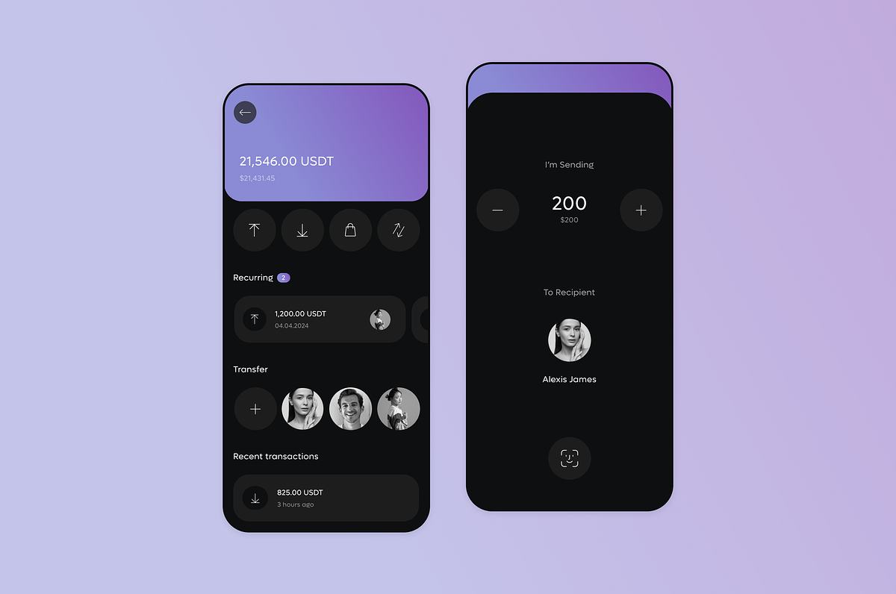

<h1>Desafio de Mobile 1</h1>

1- Reproduza a segunda tela (da direita), usando o conceito de components, usando as props.

2- Ao clicar em +, você deve incrementar o valor do dinheiro que será transferido.

3- Ao clicar em -, você deve decrementar o valor do dinheiro que será transferido.

4- Ao clicar no botão "Transferir", você deve exibir uma mensagem na tela de "Valor transferido" (usando alert)

