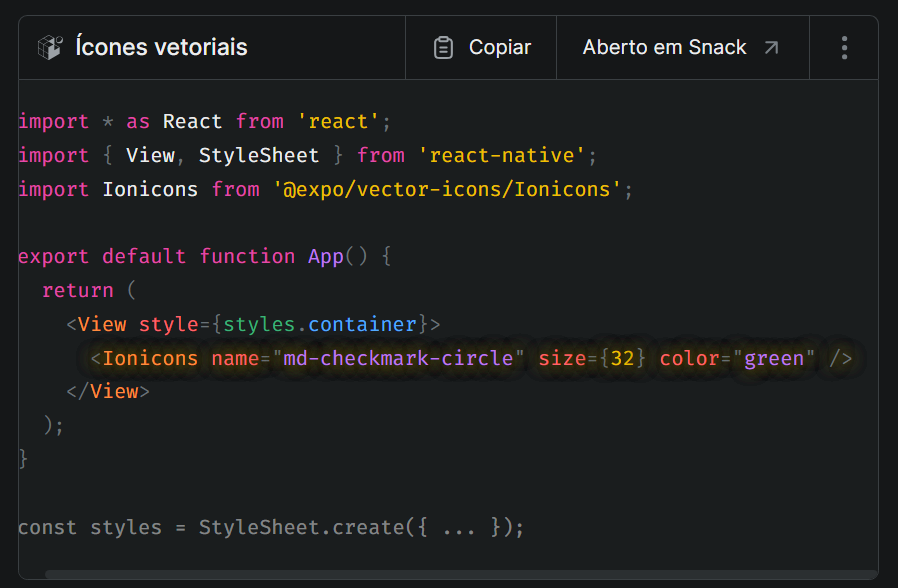
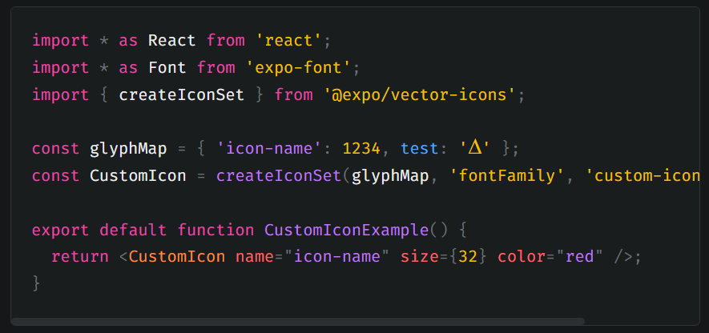
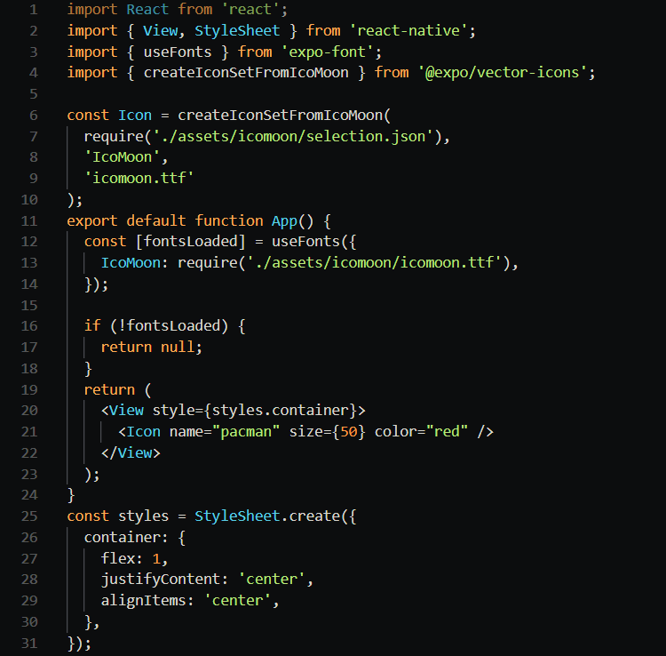
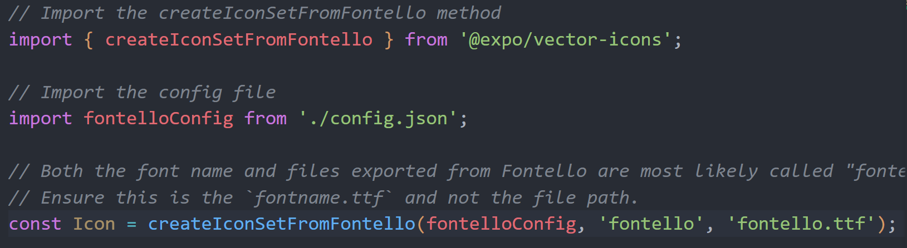
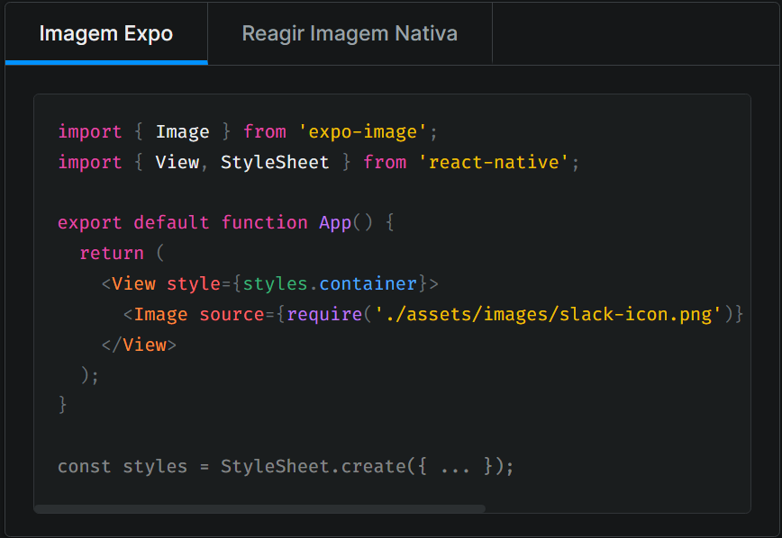
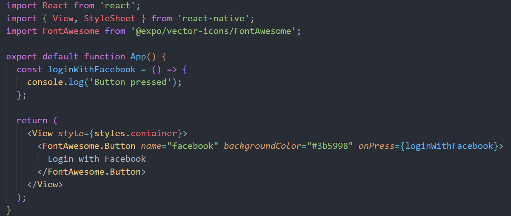

<h1>Ícones</h1>

Saiba como usar vários tipos de ícones em seu aplicativo Expo, incluindo ícones vetoriais, fontes de ícones personalizadas, imagens de ícones e botões de ícones.

Nem todo aplicativo precisa usar emojis para ícones. Você pode usar um conjunto de ícones popular através de uma fonte de ícone como FontAwesome, Glyphicons ou Ionicons, ou escolher PNGs de O Projeto Noun. Este guia explica várias maneiras de usar ícones em seu aplicativo Expo.

@expo/vector-icons
O @expo/vector-icons a biblioteca é instalada por padrão no projeto de modelo usando npx create-expo-app e faz parte do expo pacote. É construído em cima de react-native-vector-icons e usa uma API semelhante. Ele inclui conjuntos de ícones populares que você pode navegar ícones.expo.fyi.

O componente carrega o Ionicons fonte e renderiza um ícone de marca de seleção no seguinte exemplo:

Como com qualquer fonte personalizada na Expo, você pode pré-carregar fontes de ícone antes de renderizar seu aplicativo. O objeto de fonte está disponível como uma propriedade estática no componente de fonte. No caso acima, é Ionicons.font, que avalia para {ionicons: require('path/to/ionicons.ttf')}.

Fontes de ícone personalizadas
Para usar uma fonte de ícone personalizada, primeiro importe-a para o seu projeto. Somente depois que a fonte for carregada, você poderá criar um conjunto de ícones. Saiba mais sobre como carregar fontes personalizadas.

@expo/vector-iconsexpõe três métodos para ajudá-lo a criar um conjunto de ícones:

<h1>createIconSet</h1>

O createIconSet método retorna uma fonte personalizada com base no glyphMap onde a chave é o nome do ícone e o valor é um caractere UTF-8 ou seu código de caractere.

No exemplo abaixo, o glyphMap objeto é definido e depois passado como o primeiro argumento para o createIconSet método. O segundo argumento fontFamily é o nome da fonte (não o nome do arquivo). Opcionalmente, você pode passar o terceiro argumento para o suporte do Android, que é o nome do arquivo de fonte personalizado.

<h1>createIconSetFromIcoMoon</h1>

O createIconSetFromIcoMoon método é usado para criar uma fonte personalizada com base em um IcoMoo arquivo de configuração. Você tem que salvar o seleção.json e .ttf no seu projeto, de preferência no ativos diretório e, em seguida, carregue a fonte usando qualquer um useFonts hook ou Font.loadAsync método de expo-font.

Veja o exemplo abaixo que usa o hook useFonts  para carregar a fonte:

createIconSetFromFontello
O createIconSetFromFontello método é usado para criar uma fonte personalizada com base em um Fontello arquivo de configuração. Você tem que salvar o config.json e .ttf em algum lugar conveniente em seu projeto, de preferência no ativos diretório e, em seguida, carregue a fonte usando qualquer um useFonts hook ou Font.loadAsync método de expo-font.

Segue uma configuração semelhante à createIconSetFromIcoMoon como mostrado no exemplo:

<h1>Imagens de ícone</h1>

Você pode usar o Image componente de Imagem Expo ou React Native para exibir um ícone. O source prop toma o caminho relativo para se referir à imagem.

Você também pode fornecer diferentes versões do seu ícone em várias densidades de pixels. O Image componente cuida de usar a imagem com densidade de pixels apropriada automaticamente. Por exemplo, se a imagem tiver variantes como icon@2x.png e icon@3x.png, o @2x o sufixo é servido para a densidade de tela de um dispositivo para dispositivos mais antigos, como o iPhone 8 e o @3x o sufixo é servido para a densidade de tela de um dispositivo em dispositivos mais novos, como o iPhone 13. Saiba mais sobre como atender diferentes densidades na documentação do React Native.

<h1>Componente do botão</h1>

Você pode criar um Botão de Ícone usando o Font.Button sintaxe onde o Font é o conjunto de ícones do qual você importa @expo/vector-icons.

No exemplo abaixo, um botão de login usa o FontAwesome conjunto de ícones. Observe que o FontAwesome.Button componente aceita adereços para lidar com a ação quando um botão é pressionado e pode envolver o texto do botão.

