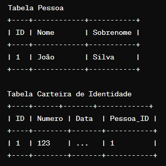
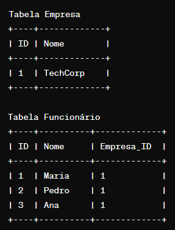
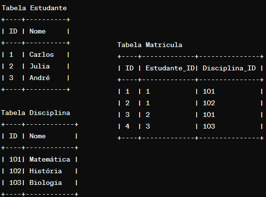
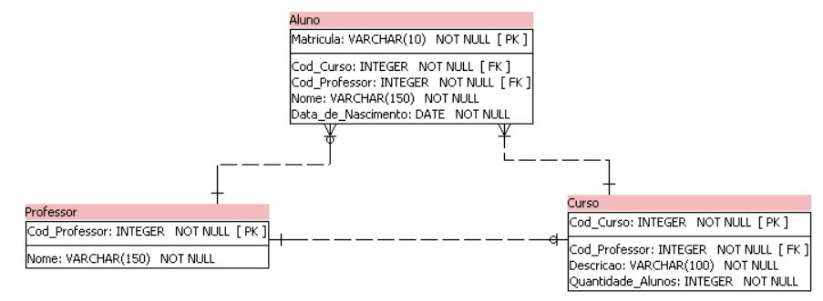
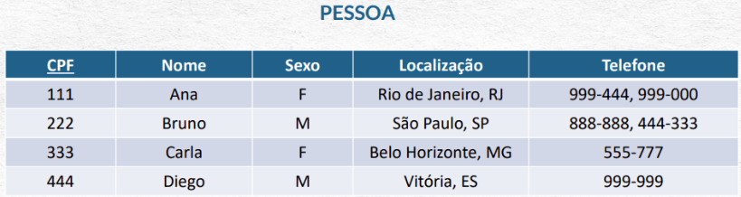
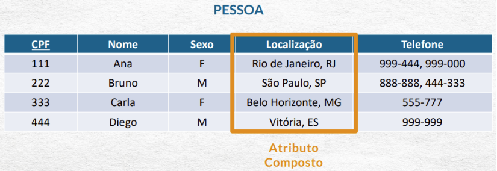
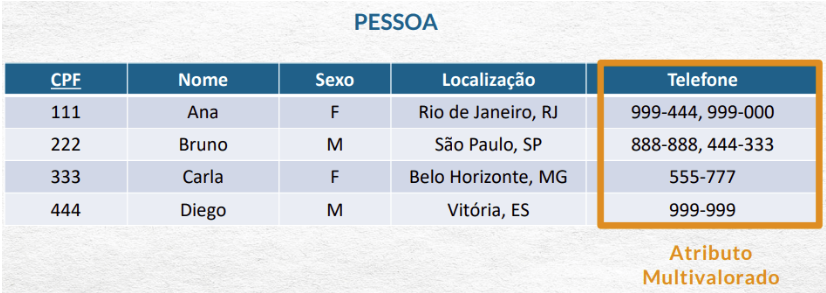
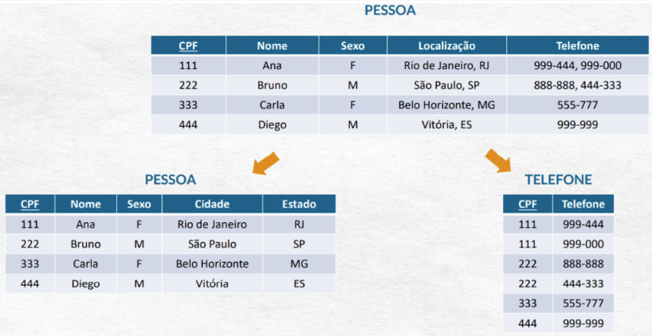

Modelo Relacional 
---
> Modelagem

É o processo de criar uma representação visual, uma diagramação do fluxo de dados. 
É como os dados vão fluir para dentro e para fora do banco de dados.

>> Dicionário de dados

Um dicionário dados é um documento usado para armazenar informações sobre o conteúdo, formato e a estrutura de uma banco de daos, assim como os relacionamentos entre seus elementos.

É importante manter um dicionário de dados para limitar erros ao criar a estrutura física do banco de dados no computador.

É uma planilha que descreve o significado de todas as informações usada na construção de um banco de dados.

É um documento para auxiliar a equipe;

Vamos criar nosso dicionário de dados do banco de vendas:

[planilha_Dicionario_dados](https://github.com/ferreirabs01/v_etinerario_2024/raw/main/bancoDados/documento/Dicion%C3%A1rio%20de%20dados.xlsx)

Para quem precise criar o banco novamente segue link do script de criação com alguns dados ficticios.

[banco_dados_vendas](https://github.com/ferreirabs01/v_etinerario_2024/raw/main/bancoDados/documento/vendas.zip)

Para Orientações de como importar confira no git: 

[git_orientaçoes](https://github.com/ferreirabs01/v_etinerario_2024/tree/main/bancoDados/instalacoes)

MER
---
Modelo entidade relacionamento.
Utilizado para descrever os objetos do mundo real através de entidades, com suas propriedades que são os atributos e os seus relacionamentos.

>entidades:
representam um objeto do mundo real e que possuem uma existência independente, como: pessoas, empresa, aluno, vendedor, carro, etc...

Tres tipos de entidade:
---
Fortes que nao dependem de outras entidades para existirem.
P. EXEMPLO : LIVRO 

Fracas que dependem de outras entidades para existirem, não possui existência própria ou atributos próprios de identificação, dependendo de atributos chaves de outras entidades fortes.
p. EXEMPLO : EXEMPLAR precisa do livro para existir.

Associativas que são as entidades quando existe a necessidade de associar a um relacionamento.
P. Exemplo : MATRICULA é uma entidade associativa que para existir precisa associar a ESTUDANTE E TURMA

Atributos
---
Descrevem as propriedades das entidades. Ex. a entidade pessoa pode ter como atributo o nome, endereco, telefone, idade, data de nascimento.

Relacionamentos
---
> #Um para um

> #Um para muitos 

> #Muitos para muitos 

DER
---
Diagrama entidade relacionamento

É utilizado para representar em forma gráfica o que foi descrito no MER (Modelo Entidade Relacionamento).

Formas Normais 
---
São uma série de procedimentos aplicados em um banco de dados para garantir que as suas tabelas estejam bem estruturadas e não contenham nenhum tipo de anolmalia, seja de inclusão, atualização ou exclusão.

Anomalias são inconsistências.

A esses procedimento damos o nome de normalização.

Podemos definir a Normalização como uma sequência de passos e verificações aplicadas a um banco de dados visando eliminar, ou pelo menos minimizar, as redundâncias e inconsistências no banco.

Tal procedimento é feito a partir da identificação de anomalias de inserção, exclusão e atualização em uma relação, decompondo-a em relações mais bem estruturadas e minimizando a redundância.

Eliminar a redundância nos dados possui algumas vantagens:

* Reduzir o espaço necessário para armazenar o banco de dados;
* Melhorar a organização dos dados;
* Reduzir o impacto de atualizações, inserções e exclusões nos dados dos bancos de dados.

exemplos :

O que pode ser normalizado nesta tabela ?

o que mais ?

como podemos realizar a normalização destas duas colunas?

